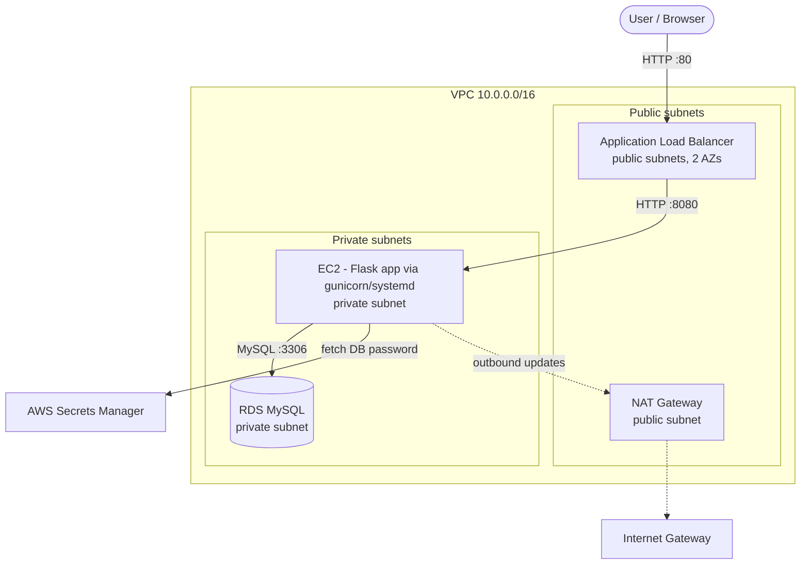

# AWS Three-Tier Web App — Build, Operate & Troubleshoot

A hands-on AWS project that deploys a **three-tier web application** (load
balancer → application → database) inside a properly segmented VPC, adds monitoring
and alerting, and documents the real problems I diagnosed and
fixed while building and operating it.

The focus of this project is **operations and troubleshooting**, not just building.
Anyone can spin up an app once; the value here is the [troubleshooting log](./troubleshooting)
of genuine failures (IAM, networking, configuration, monitoring, and Linux deployment)
with the symptom → diagnosis → root cause → fix → prevention for each.

---

## Architecture



**Tiers**
- **Web tier** — an internet-facing Application Load Balancer in public subnets across two AZs.
- **App tier** — an EC2 instance in a private subnet running a Flask app served by
  gunicorn under a systemd service. The DB password is fetched at runtime from Secrets Manager.
- **Data tier** — a private RDS MySQL instance, reachable only from the app tier.

**Network & security**
- Public subnets route to an Internet Gateway; private subnets reach the internet
  outbound only via a NAT Gateway.
- Three tiered security groups: each tier accepts traffic only from the tier in front
  of it (ALB→app on 8080, app→DB on 3306), referenced by security group, not IP.
- The EC2 instance is private (no public IP) and accessed via **SSM Session Manager** —
  no SSH keys, no bastion, no open inbound ports.
- Least-privilege IAM role on the instance (SSM access + read one secret).

---

## Tech stack

| Layer | Choice |
|---|---|
| Cloud | AWS (VPC, EC2, RDS, ALB, NAT, IAM, Secrets Manager, CloudWatch, SNS, SSM) |
| App | Python (Flask), gunicorn (WSGI), systemd |
| Database | MySQL on Amazon RDS |
| Access | SSM Session Manager |
| Monitoring | CloudWatch dashboards + alarms → SNS email |
| IaC (next phase) | Terraform |

---

## The application

A minimal **guestbook**: a form that writes a message to the database and a page that
lists all messages. It's intentionally simple — its job is to exercise all three tiers
so failures are visible. Two deliberate touches make it realistic:
- Reads the DB password from **Secrets Manager** at runtime (not hardcoded).
- Exposes a **`/health`** endpoint used by the ALB target group; it returns 200 only
  when the app can reach the database, so a broken DB connection also shows the target
  as unhealthy.

---

## Troubleshooting log ⭐

Real incidents, each written up as symptom → hypotheses → diagnosis → root cause → fix → prevention:

| # | Incident | Category |
|---|---|---|
| 01 | [SSM Session Manager won't connect (credential failure)](./troubleshooting/01-ssm-agent-credentials.md) | IAM / identity |
| 02 | [SSM connection times out after NAT recreate](./troubleshooting/02-nat-gateway-wrong-subnet.md) | Networking / routing |
| 03 | [App can't reach the database after reboot (lost env vars)](./troubleshooting/03-env-vars-lost-after-reboot.md) | Configuration |
| 04 | [CloudWatch alarm never fires despite the app being down](./troubleshooting/04-alarm-threshold-off-by-one.md) | Monitoring |
| 05 | [systemd service — user, path & permission cascade](./troubleshooting/05-systemd-user-path-permissions.md) | Linux / deployment |

---

## Monitoring

CloudWatch dashboard tracking EC2 CPU, ALB request count and 5XX errors, and RDS
connections. Alarms notify via SNS email on:
- `UnHealthyHostCount >= 1` — a target failing its health check (app up but broken).
- `HTTPCode_Target_5XX_Count > 0` — application-level errors reaching users.
- EC2 CPU high.

Each alarm was **tested by inducing the failure** to confirm it actually fires —
incident 04 documents a real bug found this way (a `> 1` threshold that could never
trip on a single-instance target group).

---


## How to deploy

Summary:

1. **VPC** — 2 public + 2 private subnets across 2 AZs, IGW, NAT Gateway.
2. **Security groups** — three tiered SGs (ALB, app, DB).
3. **RDS** — MySQL in the private subnets.
4. **EC2** — app instance in a private subnet, IAM role attached, reached via SSM.
5. **Deploy the app** — gunicorn under systemd (see [`deploy/systemd/`](./deploy/systemd)).
6. **ALB** — target group on `:8080` with `/health` check, listener on `:80`.
7. **Monitoring** — CloudWatch dashboard + alarms → SNS.

---

## Cost & teardown

Runs on small/free-tier-class resources. The only meaningful hourly costs are the
**NAT Gateway** and **ALB**, so the environment is built, tested, and torn down in a
session.

---

## What I learned

- Diagnosing across the whole stack: identity (IAM trust policies), networking (NAT,
  route tables, security groups), configuration (env vars, secrets), monitoring
  (choosing the right metric and threshold), and Linux deployment (users, permissions,
  Python packaging, systemd).
- Reading an error message to localize a problem — e.g. a timeout to a *public* AWS
  endpoint from a *private* instance points at routing, not the service; a DB error
  naming `localhost` points at missing configuration, not the database.
- Operating cost-consciously: what bills hourly, what can be stopped, and cleaning up
  orphaned resources (Elastic IPs).

---

## Next steps

- Codify the whole environment in **Terraform** (`terraform apply` to build,
      `terraform destroy` to tear down).
- Add an HTTPS listener (ACM certificate + 80→443 redirect).
- Add a second instance across AZs behind the ALB for true high availability.
```
